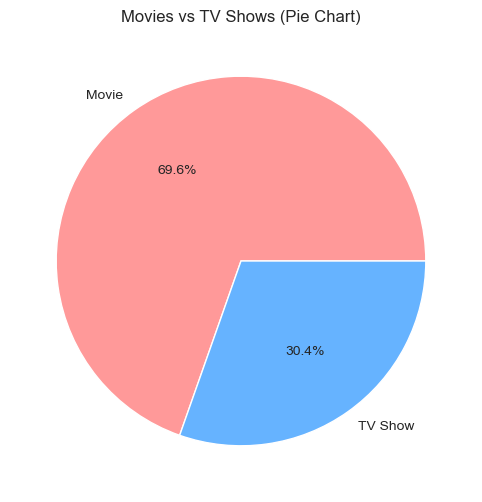

# 📺 Netflix Dataset Visualization

## Dataset
- **File:** `netflix_titles.csv`  
- **Source:** [Netflix Movies and TV Shows Dataset](https://www.kaggle.com/shivamb/netflix-shows) (Kaggle)  
- **Format:** CSV (~8,800 rows, 12 columns)  
- **Columns include:**  
  - `type` — Movie or TV Show  
  - `title` — Title of the content  
  - `director`, `cast` — Metadata about creators/actors  
  - `country` — Country of origin  
  - `date_added` — Date added on Netflix  
  - `release_year` — Release year of the content  
  - `rating` — Content rating (e.g., TV-MA, PG, R)  
  - `duration` — Duration (minutes for Movies, seasons for TV Shows)  
  - `listed_in` — Genre(s)  

---

## What I Did
Performed **Exploratory Data Analysis (EDA)** using **Seaborn** and **Matplotlib** to explore Netflix content.  

Key visualizations include:
- Count of Movies vs TV Shows  
- Distribution of release years  
- Ratings distribution  
- Top 10 countries by content  
- Release year trends by type  
- Violin plots of release year by type  
- Scatter plot of release year vs duration (Movies only)  
- Average duration by rating (Movies only)  
- Heatmap (numerical correlations)  
- Pair plots (release year & duration)  
- Pie chart of content type distribution  

---

## How to Run
1. Place `netflix_titles.csv` in the project root.  
2. Open `Plots.ipynb` in Jupyter Notebook or JupyterLab.  
3. Run all cells — plots will be generated and saved into the `Screenshots/` folder.  

---

## 📊 Visualizations
We used **Seaborn and Matplotlib** to explore the dataset.  

## 📌 Plots
### Count of Movies vs TV Shows

### Distribution of Release Years

### Ratings Distribution

### Top 10 Countries by Content

### Release Year vs Type

### Violin Plot: Release Year by Type

### Scatter Plot: Release Year vs Duration (Movies only, numeric duration)

### Bar Plot: Average Duration by Rating (Movies only)

### Heatmap: Correlation (only numerical fields)

### Pie Chart: Distribution of Content Type

---

## Key Insights
- The Netflix library is dominated by **Movies (~70%)**.  
- The most frequent ratings are **TV-MA** and **TV-14**, indicating a focus on teens and adults.  
- Content production surged significantly **after 2015**.  
- **United States and India** are the top content-producing countries.  
- Most movies have a duration of **80–120 minutes**.  

---

## Files in this Repo
- `Plots.ipynb` — Jupyter Notebook with code, plots, and analysis.  
- `netflix_titles.csv` — Dataset file.  
- `Screenshots/` — Folder containing all saved plots.  
- `README.md` — Project documentation.  

---

## Next Steps
- Deeper analysis of **genre trends** across years.  
- Explore **directors and actors** to find the most frequent contributors.  
- Compare Netflix’s growth with **competitors (Prime, Disney+, etc.)** if datasets are available.  
- Build an **interactive dashboard** to explore Netflix’s catalog by type, year, country, and genre.  

---

**Author:** Saloni Tiwari  
**License:** Open for educational use
